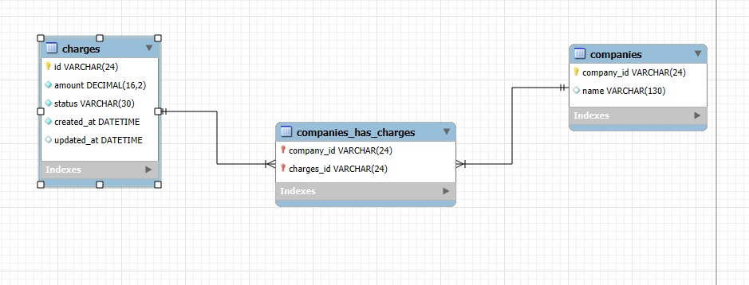

# P_Tecnica_NT
Pruebra Tecnica NT Group

La prueba tecnica fue diseñada en Docker para facilitar la instalacion y uso.

# Requisitos
- Tener Instalado Docker
- Tener Instalado Docker Compose

# Ejecución
1. Ejecutar `docker-compose build` para instalar el entorno de Python, el entorno de la base de datos MySQL 
(esto tambien instalara las dependencias necesarias).

2. Ejecutar `docker exec -it Contenedor_Python bash` para entrar a la terminal del contenedor de python.

3. Ejecutar `cd Seccion1` o `cd Seccion2` (Dependiendo del ejercicio de la prueba tecnica)

4. Ejecutar `python <nombre_archivo>` para ejecutar los programas
   (Nota en la seccion1 se debe ejecutar en orden cronologico los archivos, ya que cada uno es un punto especifico definido en la prueba tecnica)

- Si se requiere ver la DB, usar `docker exec -it Contenedor_DB  mysql -u root -p` y la contraseña es "123" y la DB "mydb"

